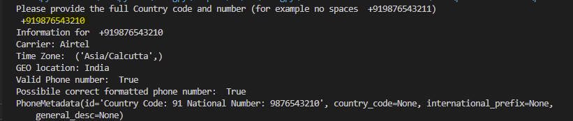

# What's phonenumberinfo script
This Python script returns information about the country and carrier of the phone number you provide as input.

# Install && Setup
`git clone https://github.com/deonvz/phonenumberinfo.git`

`pip install requirements.txt`

`python phonenumberinfo.py`

# Tested in
- [x] Windows 10 && 11
- [x] GNU/Linux distributions
- [x] Android smart phone

# Screenshot example
**include the + country code and add no spaces**

